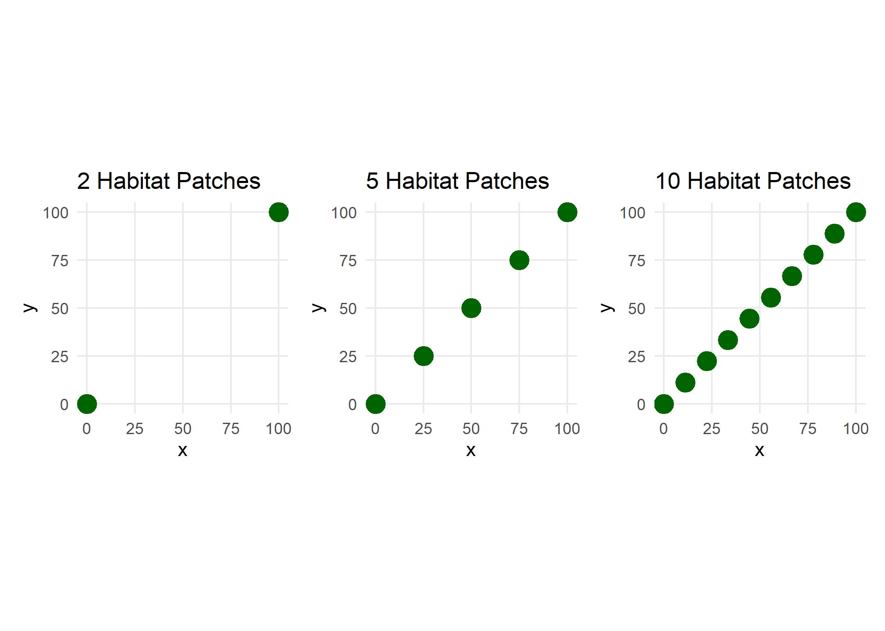
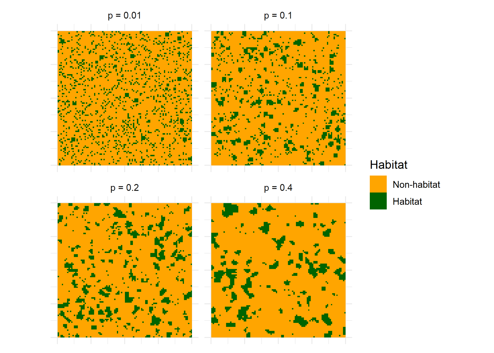
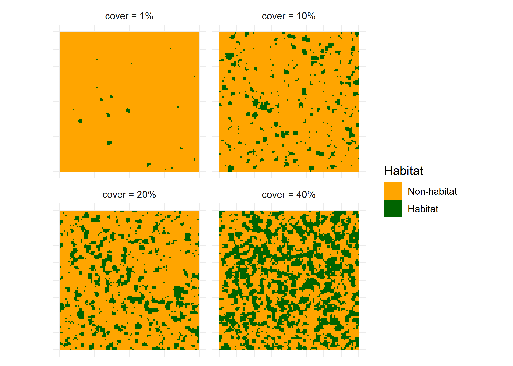

Return to Model README: [README](https://github.com/benjhodgson/metapop_capacity_matrix/blob/main/README.md)

# Exploring Metapopulation Capacity
Source Code: [Exploring Metapopulation Capacity Code](https://github.com/benjhodgson/metapop_capacity_matrix/blob/main/Source%20Code/Source_Code_Index.md#Exploring-Metapopulation-Capacity)

Before considering the effects of matrix quality, it is important to understand how metapopulation capacity changes with landscape structure. That is, how do habitat cover and habitat configuration independently, and interactively, affect metapopulation capacity.

## The independent effects of habitat cover on metapopulation capacity

To investigate the effect of habitat cover independently from the distance between habitat patches, I first generate three hypothetical landscapes with equally distanced habitat patches. This landscape has a resolution of 100 x 100 units and the landscapes have either 2, 5, or 10 habitat patches:

<!-- -->

The metapopulation capacity is then calculated for each of the three arrangements for landscapes as the area of each habitat patch increases from 1 to 500. The distances between each habitat patch remains constant, despite the area of the habitat patches increasing. Alpha was set at 0.05, which equates to a mean dispersal distance of 20 units.

Results: [The independent effects of habitat cover on metapopulation capacity Results](https://github.com/benjhodgson/metapop_capacity_matrix/blob/main/Results/Results.md#the-independent-effects-of-habitat-cover-on-metapopulation-capacity)

## The independent effects of inter-patch distance on metapopulation capacity 

To investigate the effect of the mean distance between habitat patches on metapopulation, I again create three landscapes with 2, 5, and 10 habitat patches. Each of these habitat patches has an area of 100 units and alpha is set to 0.05.

<!-- -->

The distance matrix is calculated, however this is then multiplied by a scaling factor between 1 and 5 and the metapopulation capacity is calculated.

Results: [The independent effects of inter-patch distance on metapopulation capacity Results](https://github.com/benjhodgson/metapop_capacity_matrix/blob/main/Results/Results.md#the-independent-effects-of-inter-patch-distance-on-metapopulation-capacity)

## The effects of habitat configuration on patch distances and areas

The level of spatial aggregation of habitat patches (habitat configuration) will affect the mean inter-patch distance between habitat patches. To explore this relationship, random landscapes with varying values of p will be generated and the edge density (a measure of spatial aggregation), mean nearest-neighbour distance, mean inter-patch distance, number of habitat patches, and mean habitat patch area will be recorded. 

Landscapes will be 100 x 100 with a set habitat proportion of 0.15.

p values, which dictate the level of spatial aggregation will be 0.01, 0.1, 0.2, 0.4.

An example of each of these landscapes can be seen here:

<!-- -->

There will be 100 unique landscapes for each p value.

Results: [The effects of habitat configuration on patch distances and areas Results](https://github.com/benjhodgson/metapop_capacity_matrix/blob/main/Results/Results.md#the-effects-of-habitat-configuration-on-patch-distances-and-areas)

## The effects of habitat cover on patch distances and areas
Habitat area will rarely change without also affecting the nearest distance between patches. Increasing the habitat cover, therefore will likely indirectly affect metapopulation capacity by decreasing the mean inter-patch distance between habitat patches. To explore the effect of habitat cover on  

<!-- -->

