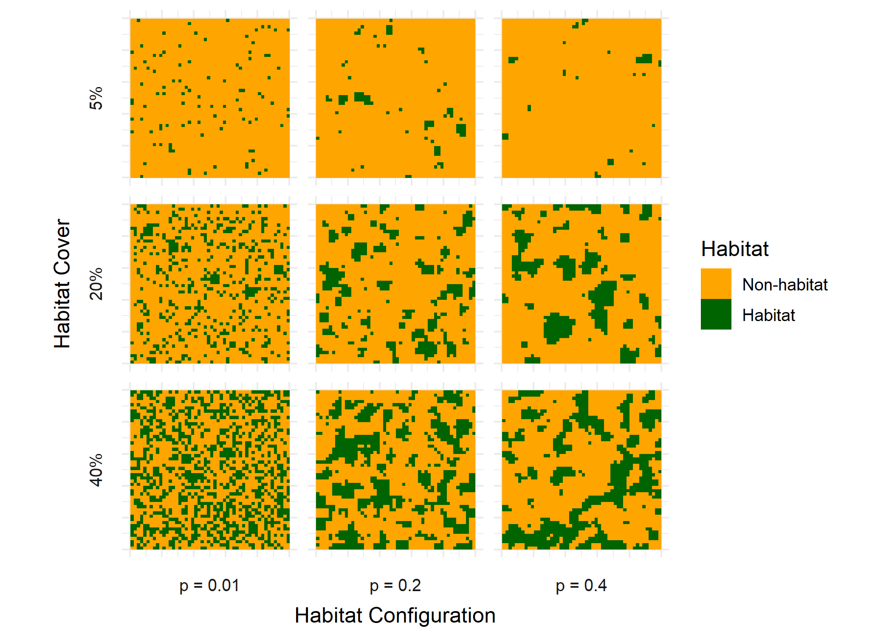

Return to Model README: [README](https://github.com/benjhodgson/metapop_capacity_matrix/blob/main/README.md)

# Background and Context

# Methodology

## Metapopulation Capacity
Metapopulation capacity ($\lambda_{M}$) is a spatially explicit version of the Levin's model. It is a unitless metric of landscape suitability for population persistence and is determined by the leading (largest) eigenvalue of a given landscape matrix. The only necessary data that are required for calculating metapopulation capacity are the areas of habitat patches, the pairwise distances between habitat patches, and the average migration distance of a given species. 

To determine whether a given landscape can support a metapopulation indefinitely, the species-specific colonisation constant $c$ and extinction constant $e$ must also be known.

A species will persist indefinitely if

\begin{equation}
\lambda_{M} > \delta
\end{equation}
where 
\begin{equation}
\delta = \frac{e}{c}
\end{equation}

The landscape matrix used to calculate metapopulation capacity is defined as:

$$
m_{ij} = \left[
\begin{array}{cccc}
0 & e^{-\alpha d_{12}} A_1 A_2 & \cdots & e^{-\alpha d_{1j}} A_1 A_j \\
e^{-\alpha d_{21}} A_2 A_1 & 0 & \cdots & e^{-\alpha d_{2j}} A_2 A_j \\
\vdots & \vdots & \ddots & \vdots \\
e^{-\alpha d_{i1}} A_i A_1 & e^{-\alpha d_{i2}} A_i A_2 & \cdots & 0
\end{array}
\right], \quad i \neq j
$$

where $d_{ij}$ is the distance between habitat patches $i$ and $j$, $A_i$ and $A_j$ are the sizes of habitat patches $i$ and $j$ respectively, and $\alpha$ is the inverse of the mean dispersal distance.

## Landscape Creation
Landscapes are created using the random cluster method within the `NLMR` R package. These are raster landscapes with each cell being either habitat or non-habitat (agricultural). The landscape extent and resolution, and habitat cover and configuration can all be configured. The real scale of the landscape (i.e. 1m or 1km resolution) is determined by the crs attributed during the calculation of the distance matrix.

Here are example landscapes showing the effect of changing habitat cover and configuration (landscapes have an extent of 50 x 50 and a resolution of 1):

<!-- -->

Unique habitat patches are identified from the landscape using the 8-neighbourhood method, meaning that cells are considered to be connected to the 8 adjacent cells. The area of each patch and the edge density are then calculated and recorded in the model output. 

The pairwise distances between habitat patches is calculated as the Euclidean nearest-neighbour distance, meaning the shortest possible straight-line distance between the edges of each pair of habitat patches. The mean nearest-neighbour distance is also calculated and recorded in the model output.

## Matrix Effects

Different species may respond differently in terms of dispersal ability to changes in the non-habitat matrix. As agricultural yield increases, and the matrix becomes 'harder', we can assume that the mean dispersal distance of a species may decrease. Conversely, as agricultural yield decreases, and the matrix becomes 'softer', we can assume the mean dispersal distance of a species may increase. Whilst this effect is likely largely dependent on species traits and the agricultural practices, we can assume a number of possible dispersal responses to agricultural yield to understand their effect on metapopulation capacity and species persistence. 

For increased simplicity in dealing with dispersal-yield functions, this work normalises yield relative to the landscape production target (i.e. for a production target of 0.5, a yield of 0.5 has a relative yield of 1). This can easily be adjusted back to real yield if using a known dispersal-yield function.

To understand the possible effects of dispersal-yield relationships on metapopulation capacity and species persistence we must consider both the shape and magnitude of the relationship. For example, the shape of the relationship (or response) could be convex, concave, or linear. The magnitude of the relationship (or dispersal ability) can be measured in the percentage increase in mean dispersal distance from a relative yield of 1 to a relative yield of 0. To parameterise the model we also need to know the initial mean dispersal distance of a species under a relative yield = 1 scenario. 

For the following possible responses and dispersal abilities for a species with a mean dispersal distance of 1 at a relative yield of 1, the dispersal-yield functions are plotted. 

As an example, if we assume that dispersal decreases with increased relative yield with a linear, concave, or convex response given by the following equations:

*Linear*
$$
Dispersal\, factor = s(1-Y) + a 
$$
*Concave*
$$
Dispersal\, factor = 1-Y^2s +a
$$
*Convex*
$$
Dispersal\, factor = (e^{10(1 - y)} \cdot s) + s_2 + a
$$
where $s$, $s_2$ and $a$ are constants, and the dispersal factor is the factor that is multiplied by the baseline (relative yield = 1) mean dispersal distance to give the actual mean dispersal distance.

And we assume that dispersal ability may increase by either *1.5x*, *5x* or *10x*, we can plot the following dispersal-yield functions:

<!-- -->

Species may have more complex dispersal responses to yield, however, these three basic responses should allow us to see the effects of matrix quality on species persistence.

