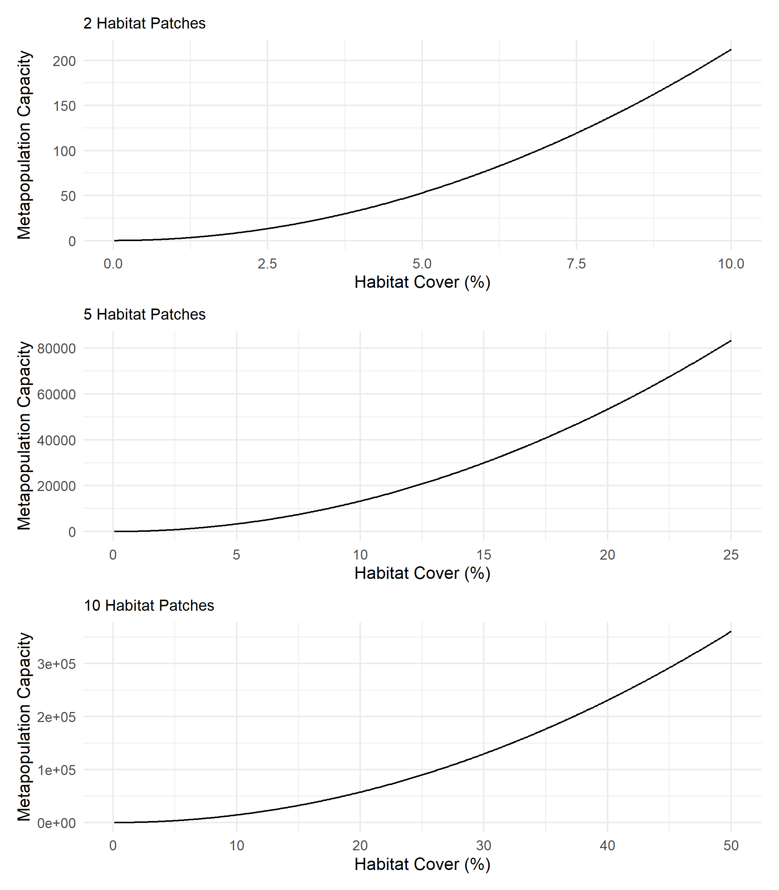
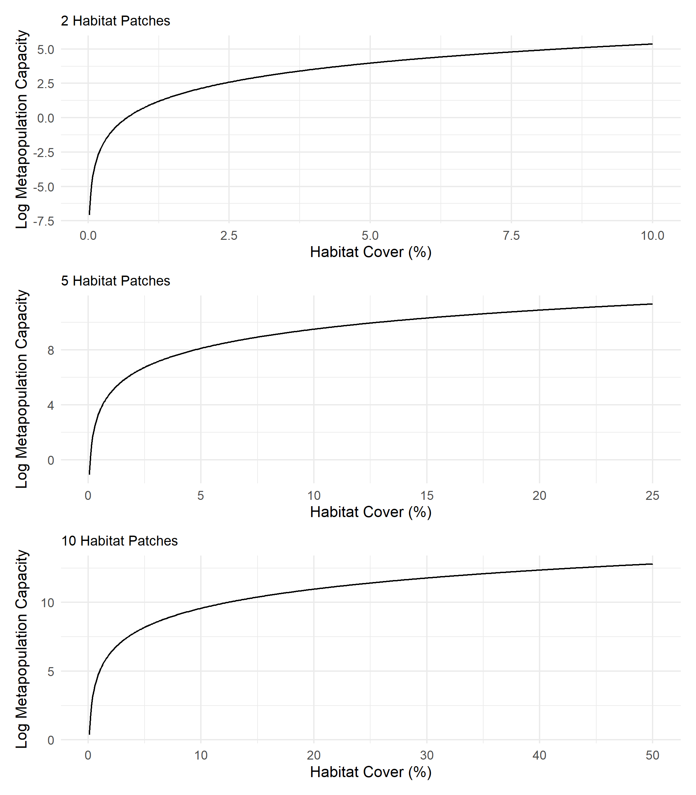
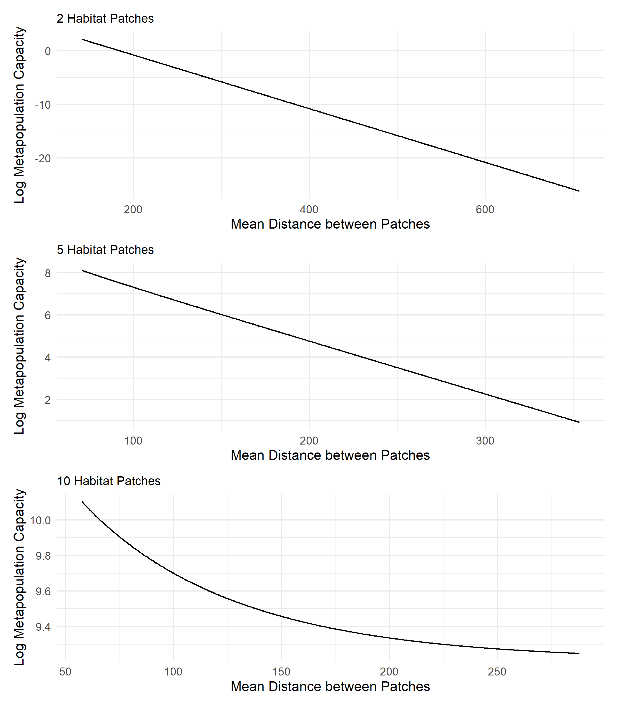
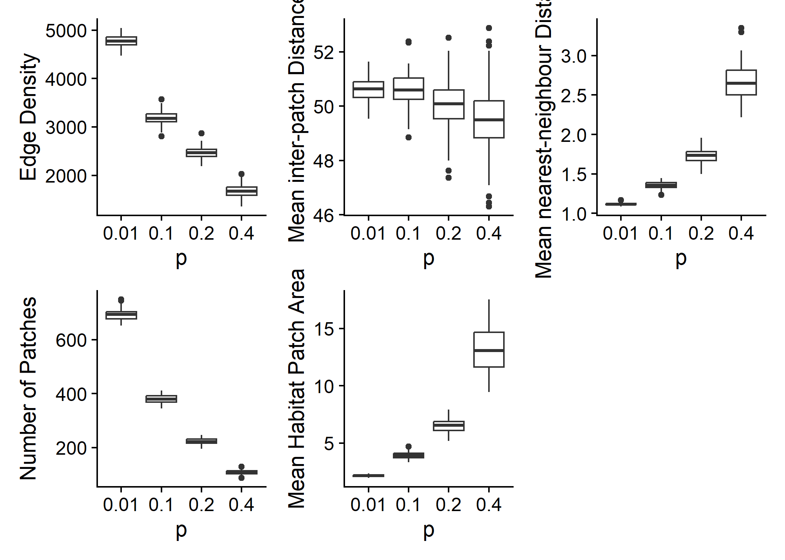
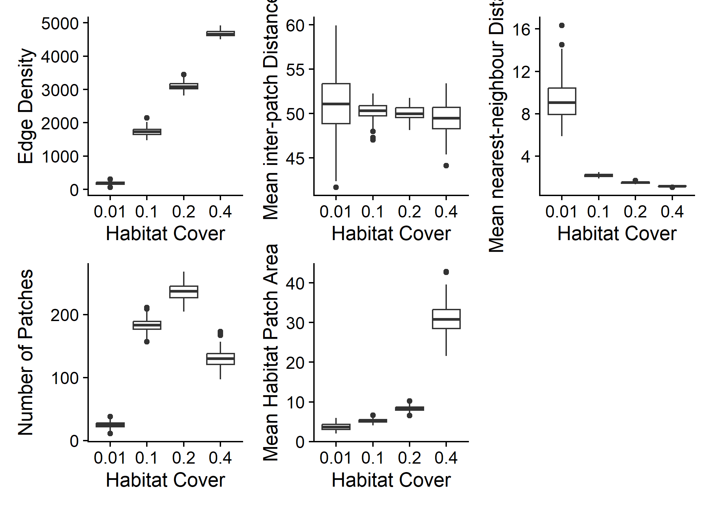
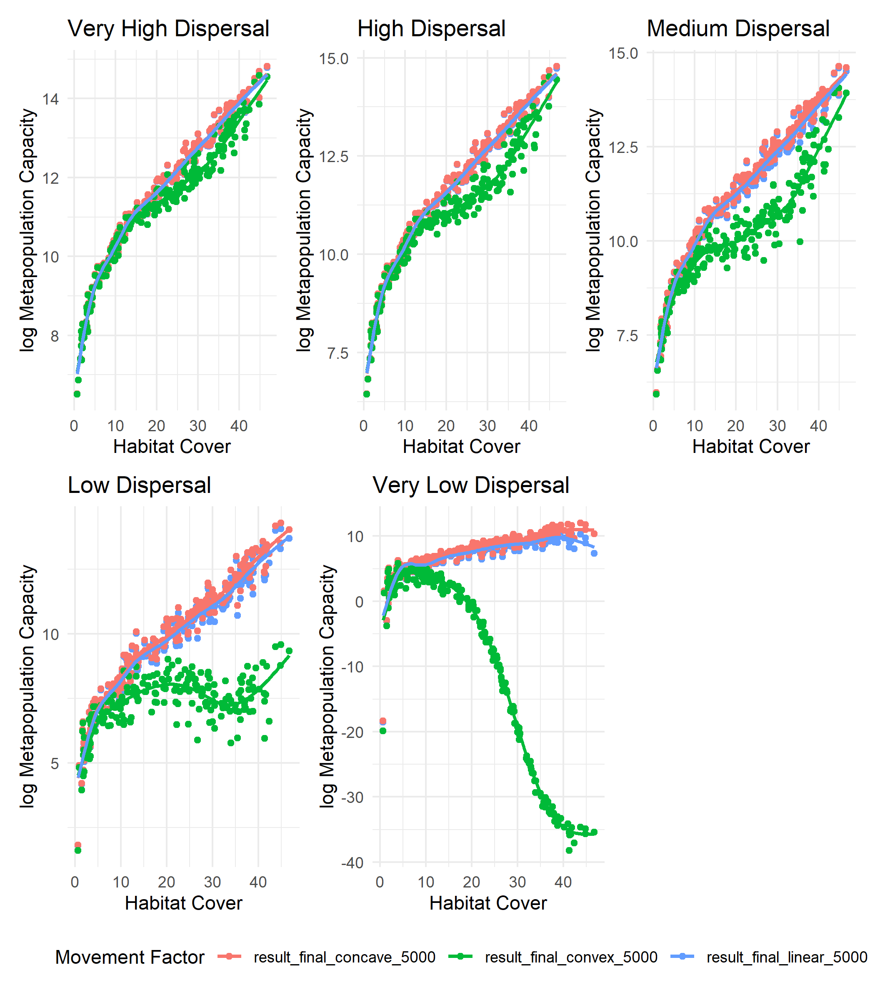
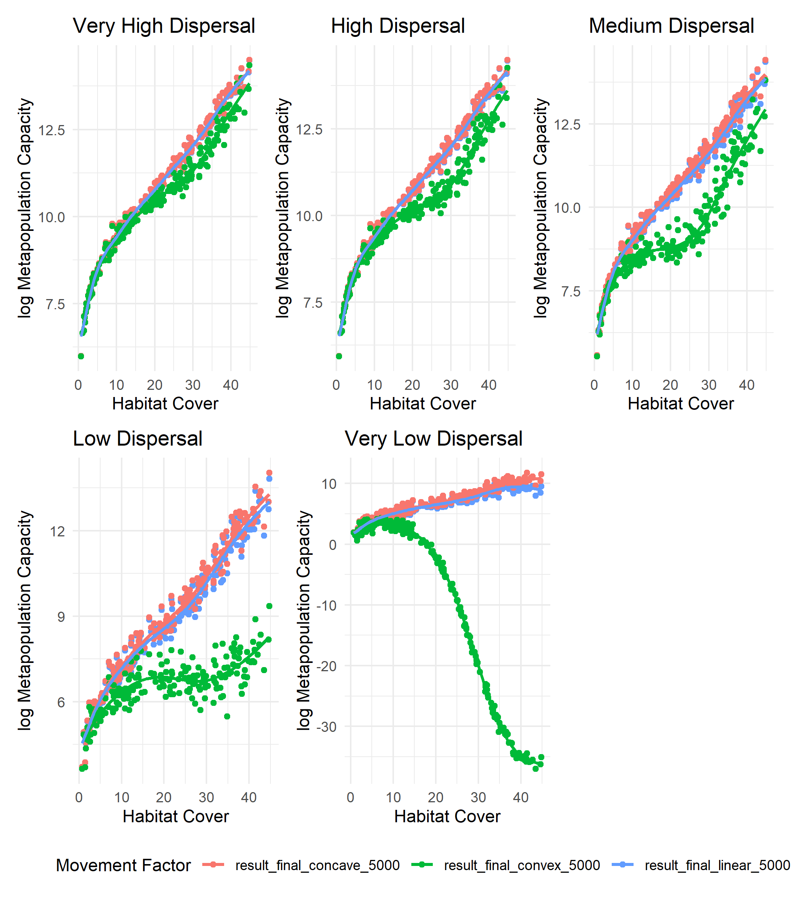
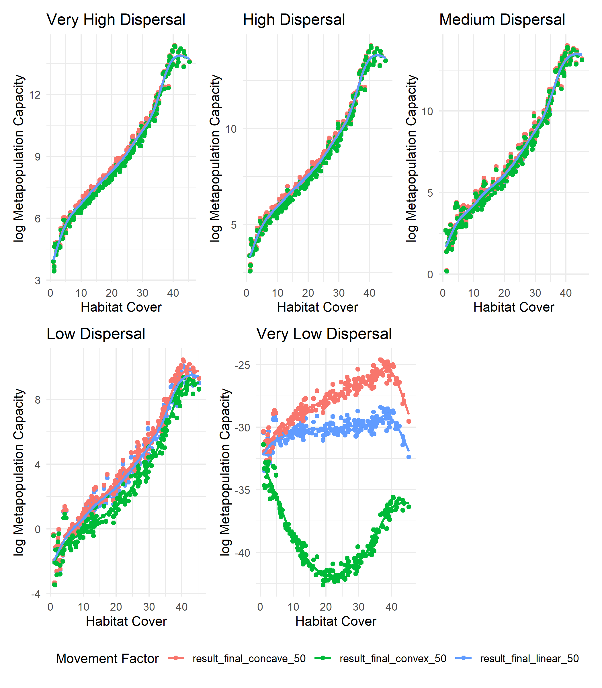

Return to Model README: [README](https://github.com/benjhodgson/metapop_capacity_matrix/blob/main/README.md)

# Exploring Metapopulation Capacity
## The independent effects of habitat cover on metapopulation capacity

Experimental Design: [The independent effects of habitat cover on metapopulation capacity - Methods](https://github.com/benjhodgson/metapop_capacity_matrix/blob/main/Documentation/Experimental-Design.md#the-independent-effects-of-habitat-cover-on-metapopulation-capacity)

Changing the size of habitat patches, without changing the distance between the habitat patches gives the following relationship between metapopulation capacity and habitat cover:
<!-- -->

The log of metapopulation capacity plotted against habitat cover gives the following results:

<!-- -->

## The independent effects of inter-patch distance on metapopulation capacity 

Experimental Design: [The independent effects of habitat cover on metapopulation capacity - Methods](https://github.com/benjhodgson/metapop_capacity_matrix/blob/main/Documentation/Experimental-Design.md#the-independent-effects-of-inter-patch-distance-on-metapopulation-capacity)

Scaling the dispersal matrix whilst keeping the habitat area constant gives the following relationship between metapopulation capacity and mean distance between habitat patches.
<!-- -->

The log of metapopulation capacity plotted against mean distance between patches gives the following results:

<!-- -->

## The effects of habitat configuration on patch distances and areas

Experimental Design: [The effects of habitat configuration on patch distances and areas - Methods](https://github.com/benjhodgson/metapop_capacity_matrix/blob/main/Documentation/Experimental-Design.md#the-effects-of-habitat-configuration-on-patch-distances-and-areas)

<!-- -->

## The effects of habitat cover on patch distances and areas

Experimental Design: [The effects of habitat cover on patch distances and areas - Methods](https://github.com/benjhodgson/metapop_capacity_matrix/blob/main/Documentation/Experimental-Design.md#the-effects-of-habitat-cover-on-patch-distances-and-areas)

<!-- -->

# The effect of Matrix Quality on Metapopulation Capacity and Persistence

## The effect of Matrix Quality on Metapopulation Capacity

### Landscapes with high levels of habitat aggregation

High levels of habitat aggregation with a maximum dispersal distance increase of 50%
<!-- -->

High levels of habitat aggregation with a maximum dispersal distance increase of 500%
<!-- -->

High levels of habitat aggregation with a maximum dispersal distance increase of 5000%
<!-- -->

### Landscapes with medium levels of habitat aggregation

Medium levels of habitat aggregation with a maximum dispersal distance increase of 50%
<!-- -->

Medium levels of habitat aggregation with a maximum dispersal distance increase of 500%
<!-- -->

Medium levels of habitat aggregation with a maximum dispersal distance increase of 5000%
<!-- -->

### Landscapes with medium levels of habitat aggregation

Low levels of habitat aggregation with a maximum dispersal distance increase of 50%
<!-- -->

Low levels of habitat aggregation with a maximum dispersal distance increase of 500%
<!-- -->

Low levels of habitat aggregation with a maximum dispersal distance increase of 5000%
<!-- -->

## The effect of matrix quality on metapopulation persistence

<!-- --><!-- --><!-- --><!-- --><!-- --><!-- --><!-- --><!-- --><!-- -->

