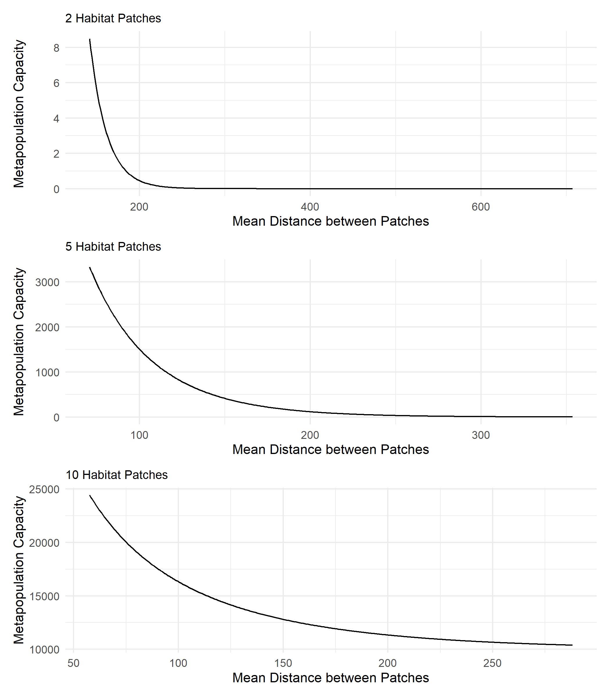

# Exploring Metapopulation Capacity
## The independent effects of habitat cover on metapopulation capacity

Experimental Design: [The independent effects of habitat cover on metapopulation capacity](https://github.com/benjhodgson/metapop_capacity_matrix/blob/main/Documentation/Experimental-Design.md#the-independent-effects-of-habitat-cover-on-metapopulation-capacity)

Changing the size of habitat patches, without changing the distance between the habitat patches gives the following relationship between metapopulation capacity and habitat cover:
<!-- -->

The log of metapopulation capacity plotted against habitat cover gives the following results:

<!-- -->

## The independent effects of inter-patch distance on metapopulation capacity 

Experimental Design: [The independent effects of habitat cover on metapopulation capacity](https://github.com/benjhodgson/metapop_capacity_matrix/blob/main/Documentation/Experimental-Design.md#the-independent-effects-of-inter-patch-distance-on-metapopulation-capacity)

Scaling the dispersal matrix whilst keeping the habitat area constant gives the following relationship between metapopulation capacity and mean distance between habitat patches.
<!-- -->

The log of metapopulation capacity plotted against mean distance between patches gives the following results:

<!-- -->
