Return to Model README: [README](https://github.com/benjhodgson/metapop_capacity_matrix/blob/main/README.md)

# Metapopulation Persistence

## Equal Colonisation and Extinction

### Sparing and Sharing with low to very high levels of dispersal

Under high or medium levels of habitat aggregation, a clear sparing response is seen for species with low to very high levels of dispersal (dispersal at relative yield = 1). I.e. the greater the proportion of habitat, the greater the difference between metapopulation capacity and the persistence threshold.

For example, here are landscapes for species with medium levels of dispersal with a medium level of aggregation with responses that increase dispersal distance by a maximum of 500%:

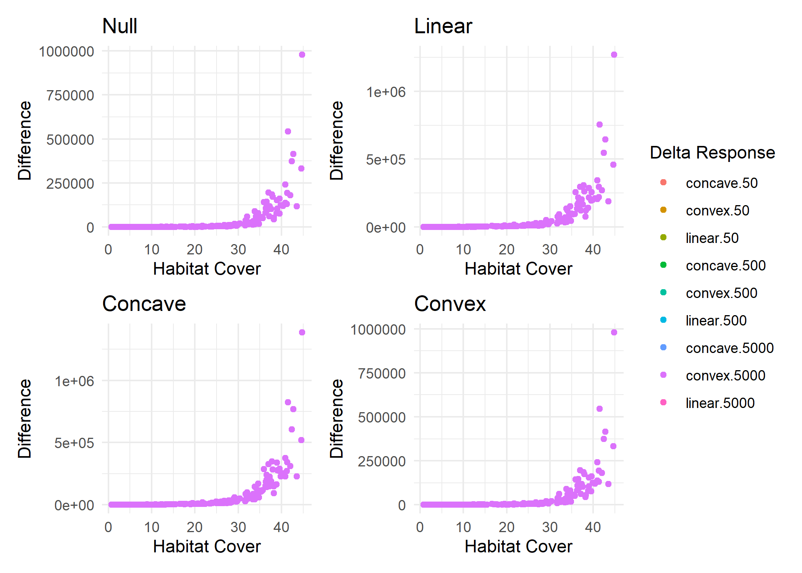<!-- -->

The plots are very similar and delta makes very little difference. We can compare them more easily when overlapped (difference from linear delta 50):
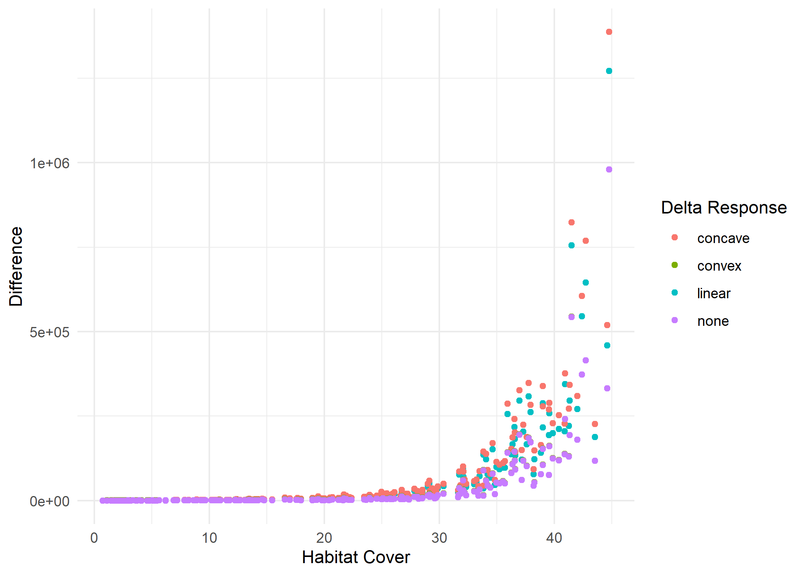<!-- -->

Now you can see that linear and concave have greater differences at high and medium levels of habitat cover. If we plot the species dispersal distance at each level of habitat cover we can see that concave and linear responses increase their dispersal ability quickly with a small decrease in habitat cover. Convex responses, however, only increase their mean dispersal distance after a substantial amount of habitat has been removed. At low levels of habitat cover, the lack of suitable habitat is more likely limiting species persistence, meaning that all responses have a low difference. 

<!-- -->

For reference, this is the mean inter-patch distance for the landscapes (medium aggregation).
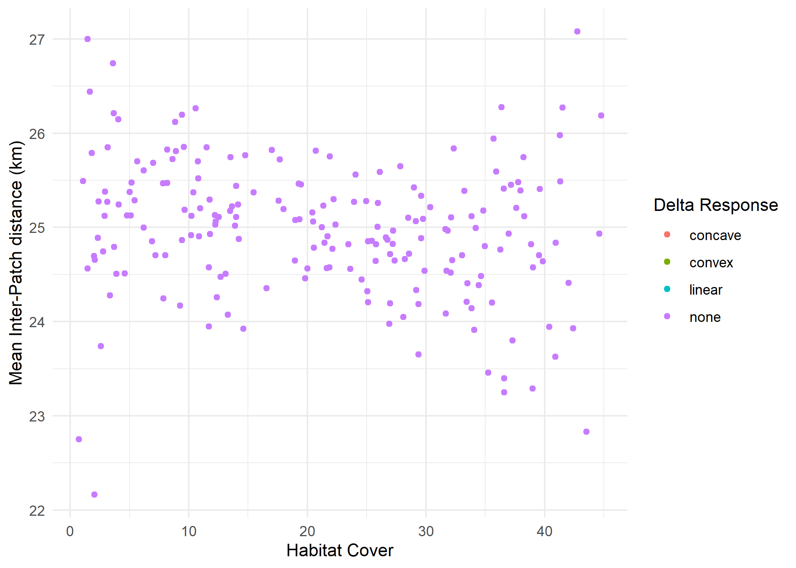<!-- -->

The magnitude of the increase in dispersal also affects the shape of the difference response to habitat cover, with higher increases in dispersal ability with yield leading to an increased difference at high and medium levels of habitat cover.

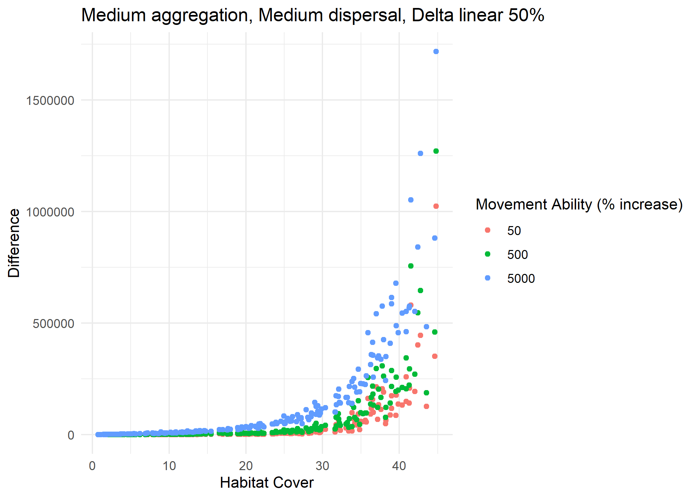<!-- -->

Finally, the shape of the difference response changes based on the original dispersal ability of the species. Here the difference between concave, convex, and linear increases as the dispersal ability of the species decreases. When a species has very high dispersal, the rapid increase in dispersal of the convex and linear responses as habitat cover decreases becomes less important, as species dispersal is already sufficient. (500% movement increase, delta has a linear 50% response medium aggregation).

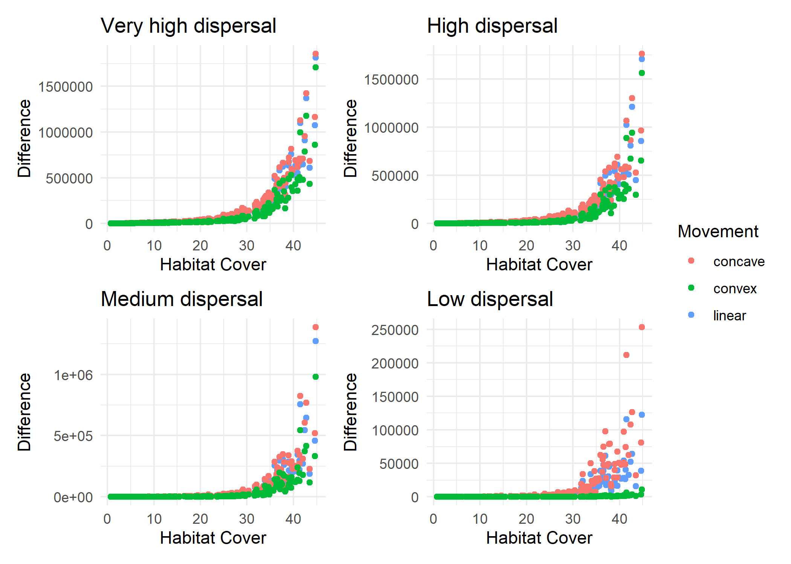<!-- -->

When we compare habitat aggregation levels, we can see that metapopulation capacity rises much quicker in low aggregation landscapes than in medium or high aggregation landscapes. This may be due to smaller distances between patches in low aggregation landscapes, meaning total habitat area can have a greater impact on metapopulation capacity.  (Difference from linear delta 50% for 500% responses):
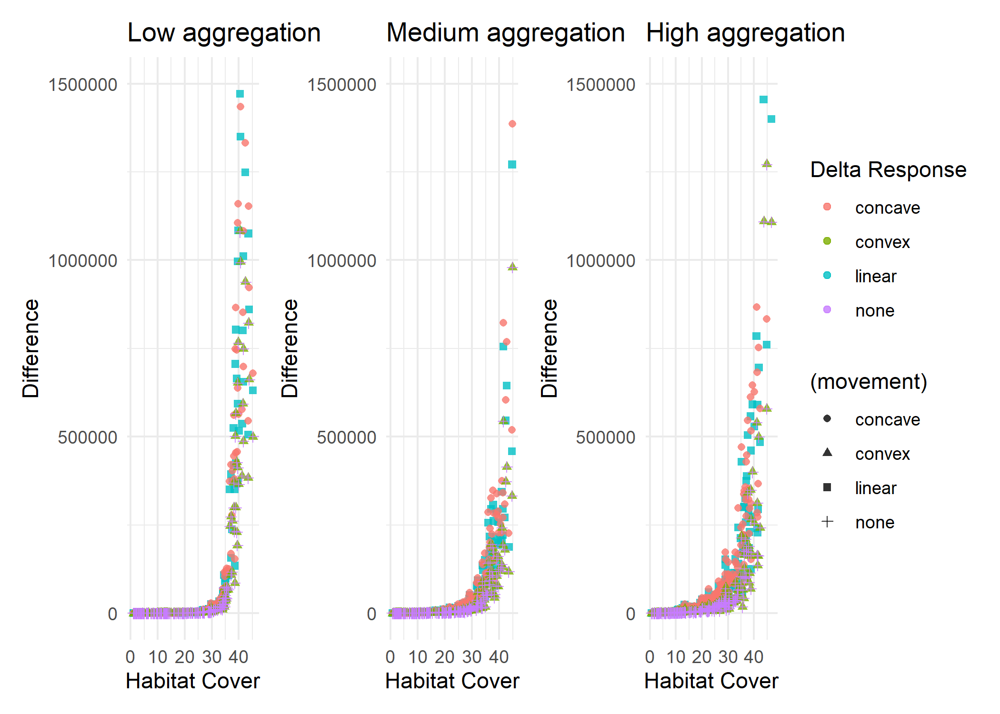<!-- -->

A unique result can be seen when dispersal ability increases massively (5000%) in a convex way in medium and high aggregation landscapes.This is most evident in high aggregation landscapes, is less evident in medium aggregation landscapes, and is not clearly visible in low aggregation landscapes.

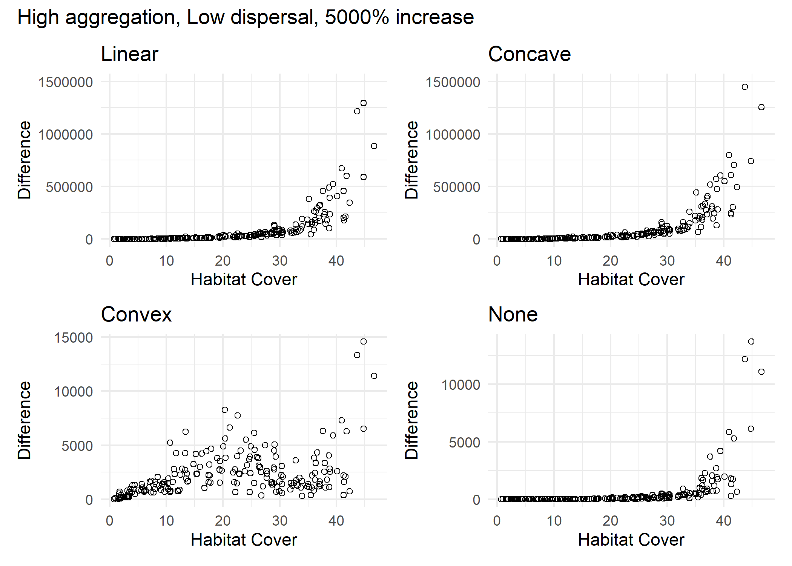<!-- -->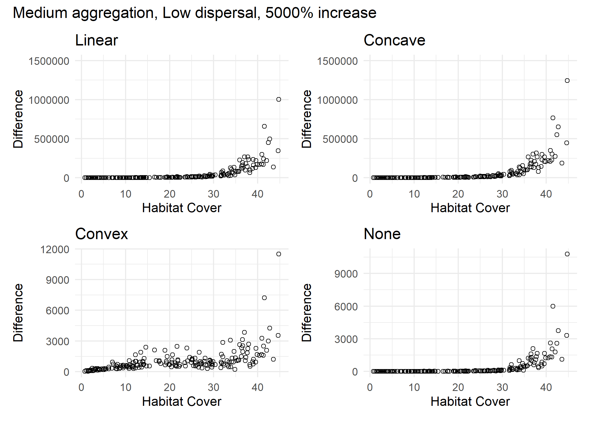<!-- -->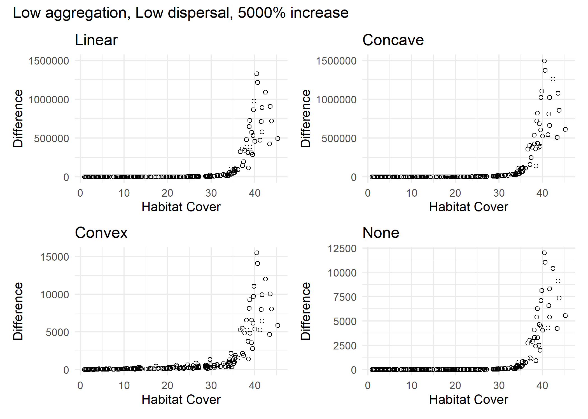<!-- -->

For reference here are the dispersal increase curves for 5000%:
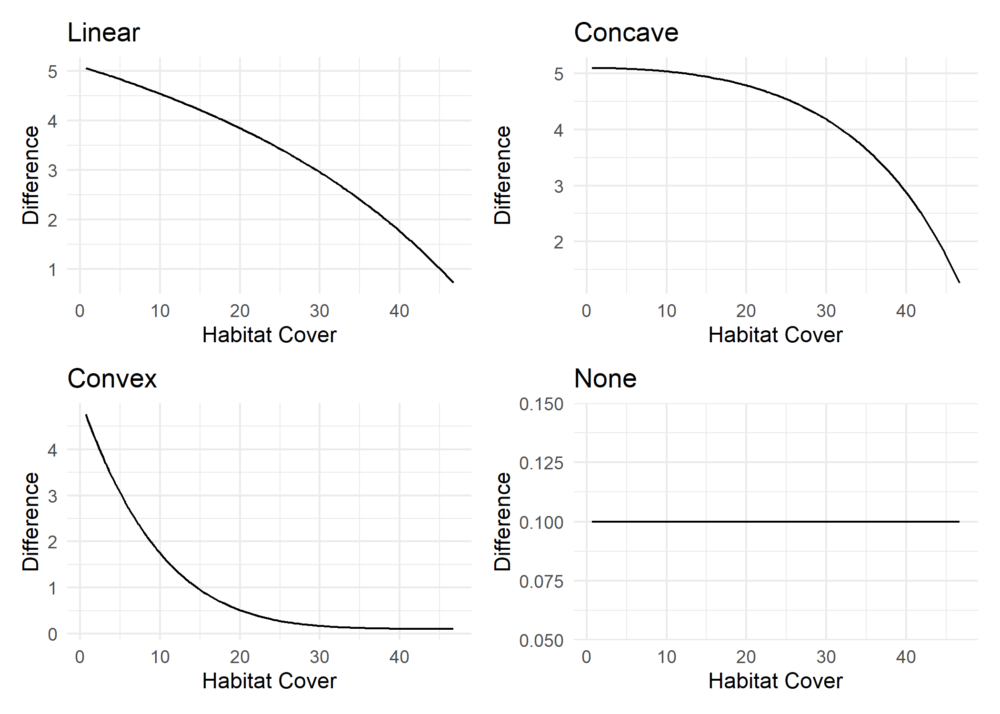<!-- -->

Here, linear and concave follow a similar pattern as described previously. The convex response however has a much reduced difference at medium to high levels of habitat cover (note the y axis). If, however, you look closely at the convex response, you can see a multimodal response. Difference increases with habitat cover to around 20% habitat cover. It then declines before increasing again at around 35%. This pattern is due to linear and concave responses having sufficient dispersal at intermediate to high levels of cover for the difference to increase continuously in line with habitat cover. For the convex response however, difference first increases with habitat cover (dispersal is sufficient here), but then declines as dispersal declines quickly. It is only when habitat cover continues to increase that the difference begins to increase again, although this increase is small in comparison to the linear and concave responses due to a lack of dispersal ability. For low aggregation landscapes, the smaller distance between habitat patches likely means that increased dispersal has less of an impact on metapopulation capacity. The difference between metapopulation capacity and the persistence threshold is much smaller at these intermediate levels of habitat cover for low aggregation landscapes compared to high aggregation landscapes. High aggregation landscapes likely benefit from larger patch sizes but are more limited by insufficient dispersal. When dispersal increases, metapopulation capacity can peak higher than in low aggregation landscapes.

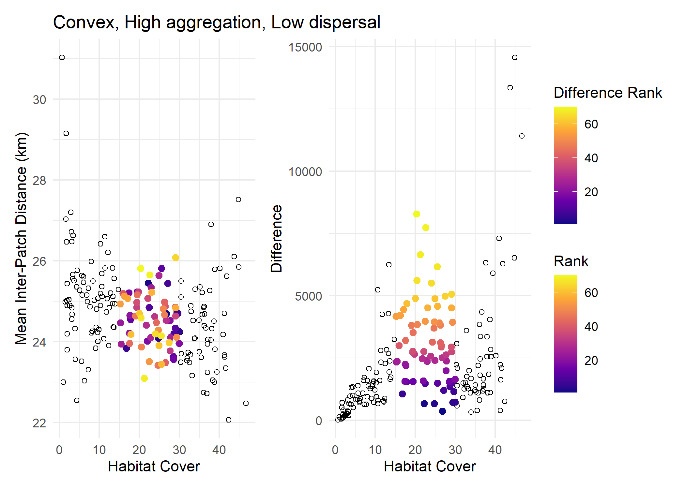<!-- -->

The large variation is not obviously due to a difference in mean inter-patch distance, edge density, number of patches or the mean size of patches. For landscapes with a landscape cover of 20-22%, the landscapes with the lowest and highest difference are shown:

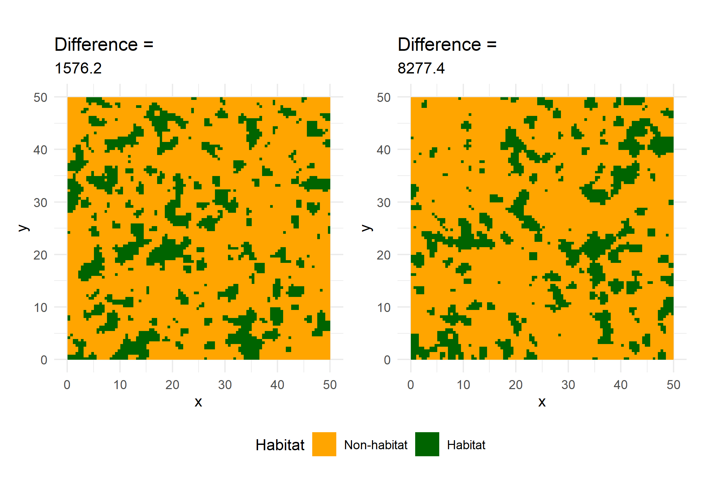<!-- -->

### Sparing and Sharing with very low levels of dispersal

When the mean dispersal of species is highly limited (10 m at relative yield = 1), a clear sparing response is no longer seen. For example, when habitat aggregation is low and there is a very large increase in dispersal ability, the difference between metapopulation capacity and the persistence threshold is greatest before the maximum amount of habitat for linear, concave and convex responses. For the null response (no increase in mean dispersal distance), metapopulation capacity is so low that even if the colonisation constant increased dramatically, persistence would not be possible. For the linear and concave responses, the difference peaks just above 40% habitat cover and declines rapidly approaching 45% habitat cover. The difference remains quite large here, although there remains a large level of variation. For the convex response, the difference peaks at around 5-10% habitat cover. Again there is a large variation, however, the magnitude of the difference for the convex response is very low, and differences between the possible delta responses can be seen.

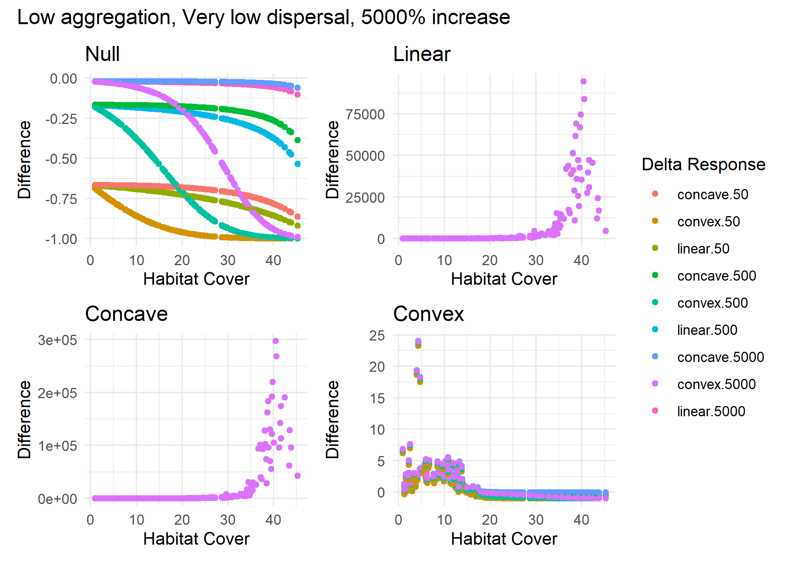<!-- -->

The reason for the shape of the results is clear when we again look at the dispersal responses. At a habitat cover of ~40%, the linear and concave responses, have allowed for enough of an increase in dispersal for metapopulation capacity to increase substantially. At habitat covers greater than 45%, metapopulation capacity is limited by a lack of dispersal ability in the concave and linear responses. Below 40%, metapopulation capacity is limited by the amount of available habitat despite sufficient dispersal ability in the concave and linear responses. For the convex response, a dispersal ability similar to those at 40-45% habitat cover in the linear and concave responses is not achieved until habitat cover has reduced to around 5-10% habitat cover. This increase in dispersal ability allows for a peak in metapopulation capacity, however, habitat cover is a limiting factor here, and so metapopulation capacity only increases a relatively small amount before decreasing again due to limited habitat.

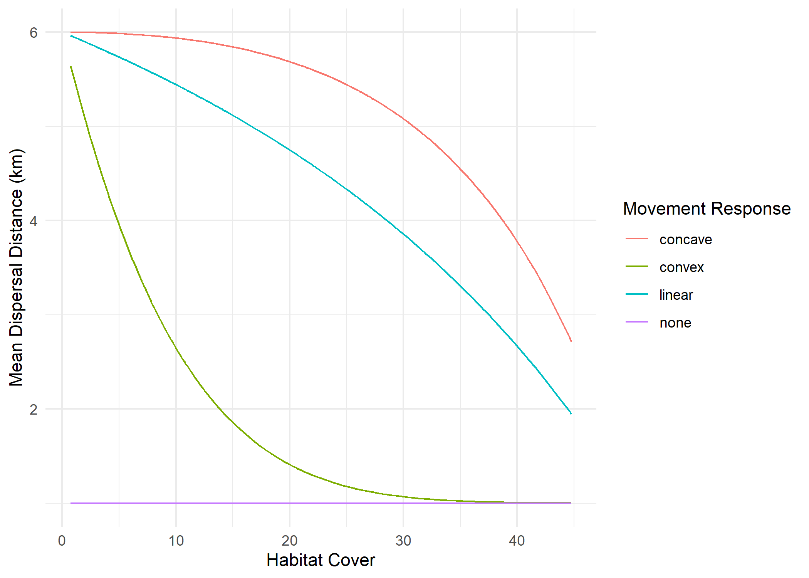<!-- -->

At high levels of habitat cover and low levels of habitat aggregation, it can be very difficult to explain the exact underlying reason for variation, even though the variation has to be a product of the habitat structure. For example these two landscapes have habitat covers between 40 and 42% but differ dramatically in their metapopulation capacity. 
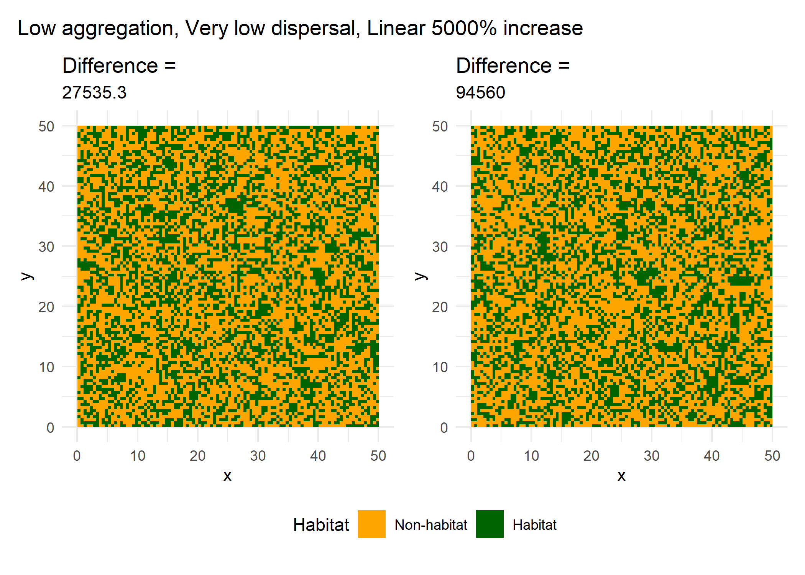<!-- -->

For very poor disperses in low aggregated landscapes when the increase in dispersal ability is not as extreme (only 500% increase), only the concave dispersal response can really allow for some species persistence. For the concave response, the peak is slightly lower (~25-40% habitat cover), the maximum difference is very small, and the importance of how the colonisation constant, and in turn the persistence threshold changes in response to yield becomes much more visible. The linear and convex responses are very similar to the null response. By the time dispersal ability increases, habitat cover is too low, and the dispersal increases is too little to greatly increase the difference. 

<!-- -->

When the dispersal increase is less still, all responses are very similar to the null response:

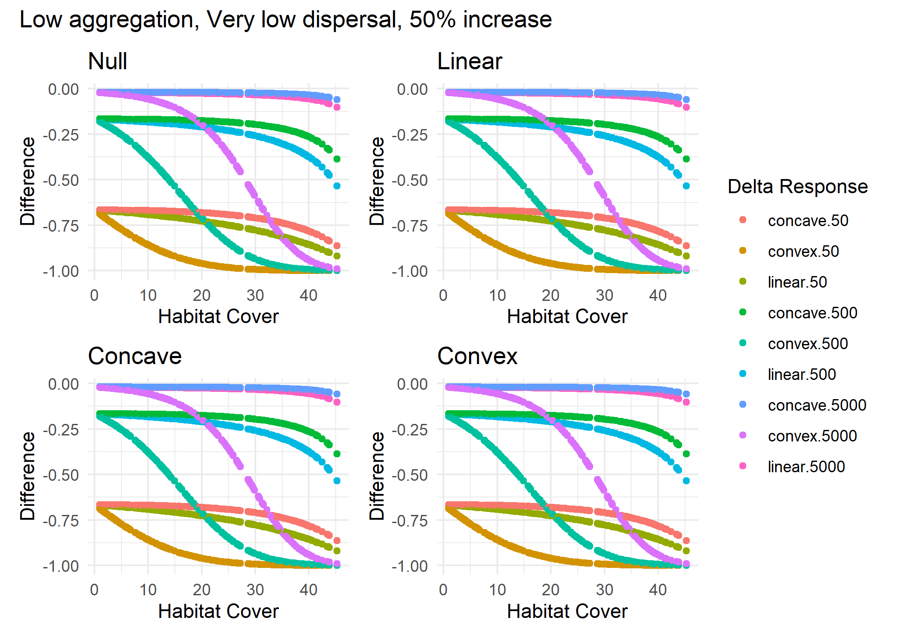<!-- -->

A similar pattern can be seen across levels of habitat aggregation, however, there is a trend of increasing difference variation as aggregation increases. The peaks in difference also widen. For example, in low aggregation landscapes, the difference peaks between ~35% to ~40% habitat cover for the concave response. This peak widens to ~20% to ~40% in high aggregation landscapes.

It can also be seen that with increased aggregation, more landscapes fall above the persistence threshold for the linear response (500%), although this is only the case when the colonisation constant also increases a great amount (500% +).

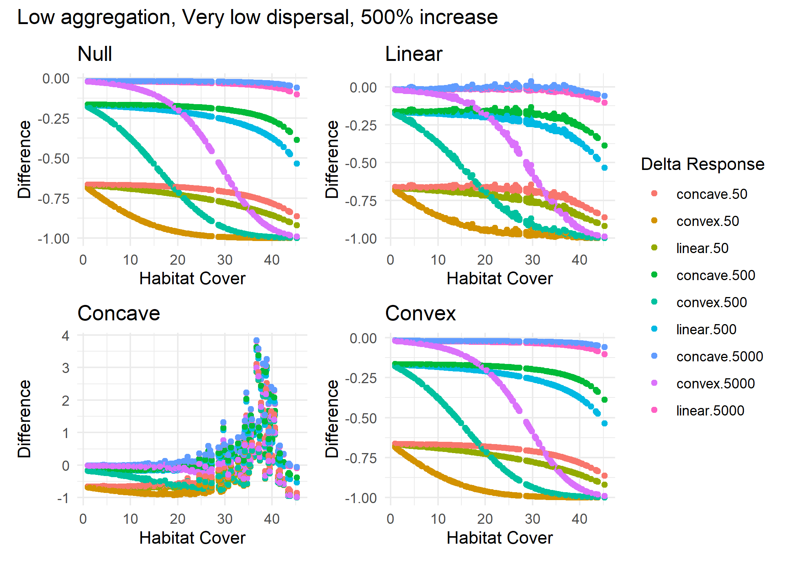<!-- -->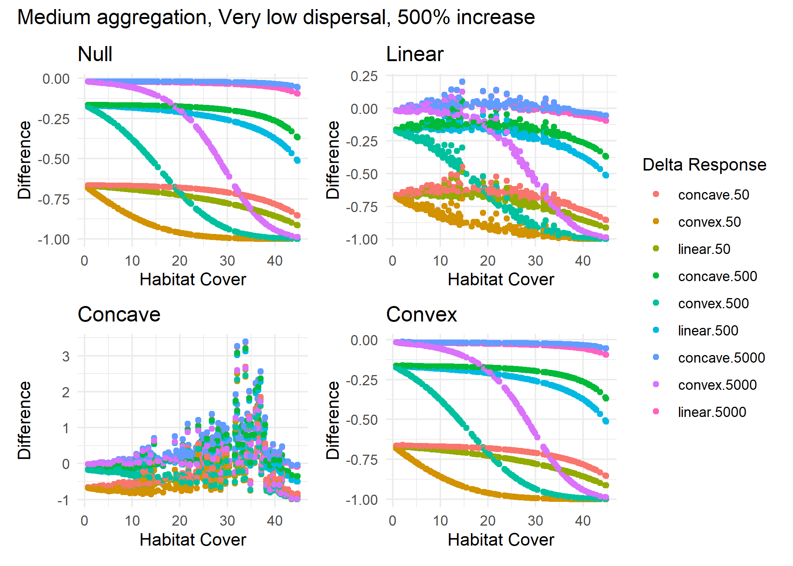<!-- -->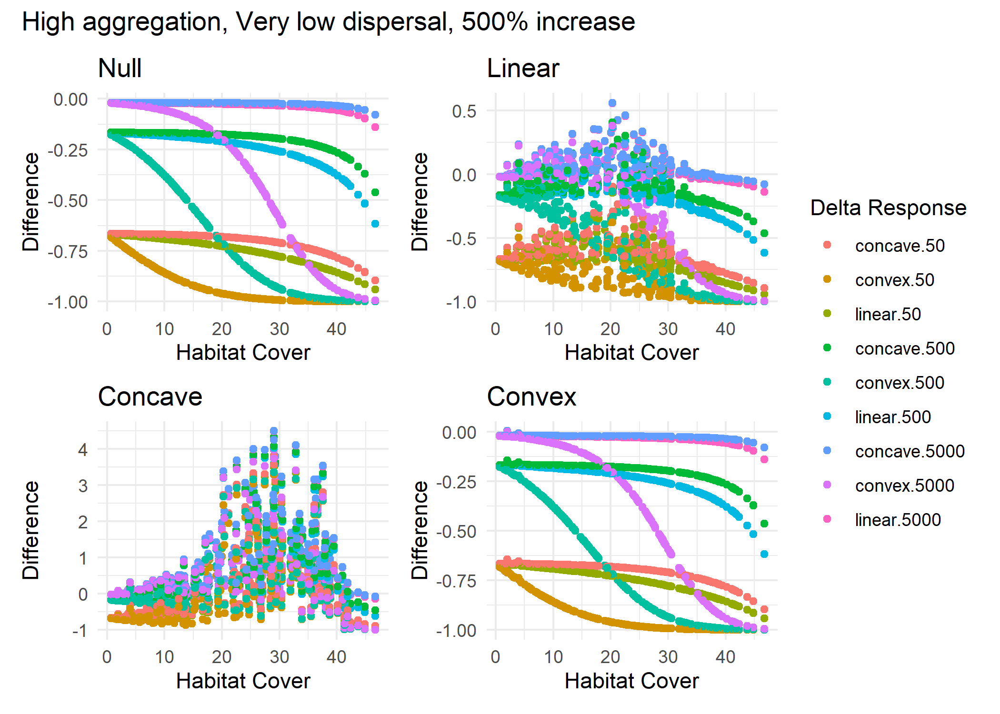<!-- -->

## Unequal Colonisation and Extinction

The results when the colonisation and extinction constants are equal at a relative yield of 1, and when the colonisation constant is much greater than or much less than the extinction rate are largely similar. There are, however, some key differences. 

### Sparing and Sharing with low to very high levels of dispersal

The high levels of metapopulation capacity seen in the sparing responses, mean that differences in delta make little difference to whether a species can persist in a given landscape. 

### Sparing and Sharing with very low levels of dispersal

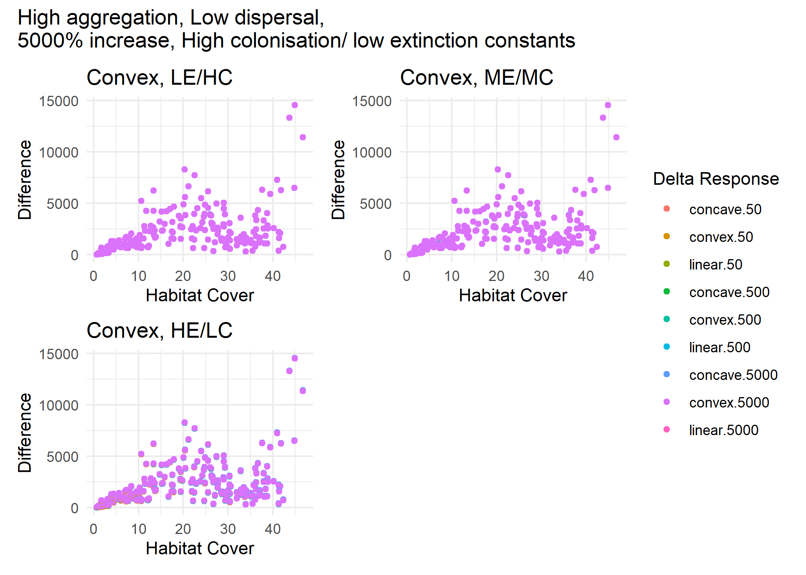<!-- -->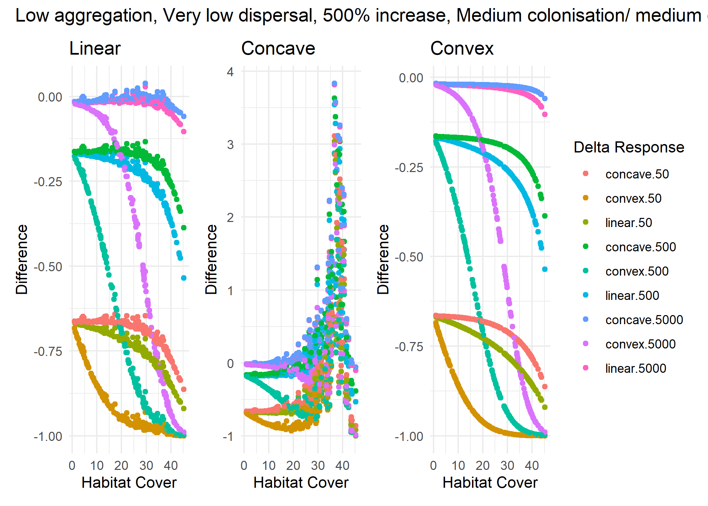<!-- -->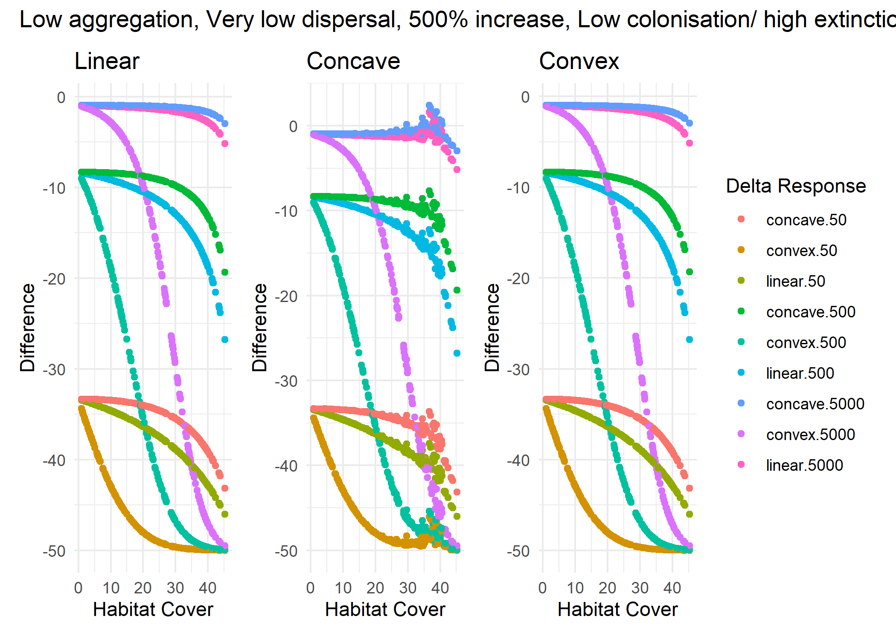<!-- -->

